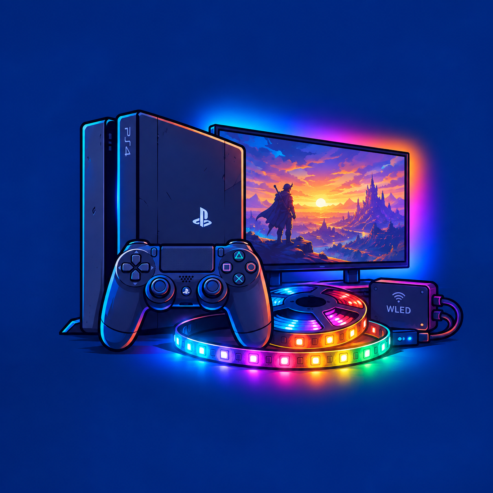

# PS4 Ambilight

<p align="center">
  
</p>

An Ambilight-style setup for jailbroken PS4 consoles: a [GoldHEN](https://github.com/GoldHEN/GoldHEN)
plugin samples the console's video output every frame and streams the edge colors over the
network (DDP protocol) to a real [WLED](https://kno.wled.ge/) LED controller in real time while
you play. A companion homebrew app provides an on-console UI for editing settings and previewing
colors live.

See [CHANGELOG.md](CHANGELOG.md) for the version history of both the plugin and the companion app.

## Layout

```
PS4-Ambilight/
├── plugin/            # the GoldHEN plugin itself (runs on the PS4, hooks the video-out path)
│   ├── source/          # main.c + 8 supporting modules (gamma, network, tiling, hooks, ...)
│   ├── include/         # config.h, ambient_internal.h
│   ├── config/          # default ps4_ambient_light.ini
│   └── Makefile
├── common/             # plugin_common.{h,c} -- shared GoldHEN plugin helpers this build needs
├── companion-app/      # standalone PS4 homebrew app: on-console settings UI + live preview
│   ├── source/, include/, assets/, sce_sys/, sce_module/
│   └── tests/           # isolated unit tests for settings/pipeline/layout logic
├── tools/               # PC-side Python/C helper scripts used for capture and verification
├── .github/workflows/CI.yml
├── CHANGELOG.md
├── LICENSE
└── .gitignore
```

## Building the plugin

Requires the standard GoldHEN plugin toolchain:
- [OpenOrbis PS4 Toolchain](https://github.com/OpenOrbis/OpenOrbis-PS4-Toolchain) (`OO_PS4_TOOLCHAIN`)
- [GoldHEN SDK](https://github.com/GoldHEN/GoldHEN_Plugins_SDK) (`GOLDHEN_SDK`) -- headers + `libGoldHEN_Hook.a`,
  **with [`patches/goldhen-sdk-detour64-fix.patch`](patches/goldhen-sdk-detour64-fix.patch) applied** (see below)
  -- without it, hooking crashes or silently no-ops on real hardware.

```
git clone https://github.com/GoldHEN/GoldHEN_Plugins_SDK.git
cd GoldHEN_Plugins_SDK
patch -p1 < /path/to/PS4-Ambilight/patches/goldhen-sdk-detour64-fix.patch
make
```

Then point `GOLDHEN_SDK` at that directory and build the plugin as usual:

```
cd plugin
make
```

Output lands in `bin/plugins/` (created next to this repo root). CI applies this same patch to a
fresh SDK checkout before every build (see `.github/workflows/CI.yml`), so a tagged release is
always built against the patched SDK -- a local build only gets those same fixes if you patch your
own `GOLDHEN_SDK` copy too.

## Building the companion app

See [`companion-app/README.md`](companion-app/README.md) for its build steps and design notes.

## Configuration

Copy `plugin/config/ps4_ambient_light.ini` to `/data/ps4_ambient_light.ini` on the console (or
edit it live from the companion app) and set `wled_host`/`wled_port` to your WLED controller,
plus your strip's per-edge LED counts under `[layout]`.

## Help

The companion app's own Help screen (Home → Help) keeps things to five short cards -- just
enough to get set up and unstuck. This section is the long version: everything that didn't fit
there. From that screen, pressing **△ Triangle** opens a QR code pointing straight back at this
heading, so you can pull it up on a phone without typing a URL on a controller.

### Getting started

1. Get [GoldHEN](https://github.com/GoldHEN/GoldHEN) running on your PS4 first -- this
   project is a GoldHEN plugin plus a standalone companion app, not a jailbreak on its own.
2. Install the companion app's `.pkg` (from a tagged [release](../../releases), or built
   yourself per [`companion-app/README.md`](companion-app/README.md)) like any other homebrew
   package.
3. Launch the companion app and open it to **Home**. The main button there reads **Install**,
   **Update** or **Enable** depending on what it finds:
   - **Install** -- `ps4_ambient_light.prx` isn't on the console yet. Pressing it downloads the
     latest release build to GoldHEN's plugin folder.
   - **Update** -- the `.prx` is installed but older than the latest release.
   - **Enable** -- the `.prx` is present but its `plugins.ini` entry is commented out or
     missing, so GoldHEN isn't actually loading it.
   - Once installed and enabled, the button becomes **Test Strip** instead (see below).
4. Go to **Set up** and enter your WLED controller's address and your strip's physical layout
   (both covered in detail below). Home won't let you run **Test Strip** until this is done --
   pressing the CTA before then just shows a reminder toast, it doesn't silently do nothing.
5. **Test Strip** (Home's CTA button once setup is complete) sends live colors from the
   companion app itself straight to your WLED controller, so you can check wiring, layout and
   color order *before* trusting it inside an actual game.
6. Start a game. The plugin hooks the video-out path itself, so there's nothing further to
   launch -- if `wled_host` is set and the strip is reachable, it starts streaming automatically.

### Connecting to WLED

Both the plugin (`[network]` in the ini) and the companion app's **Set up** screen want the
same two values:

- **WLED host** -- your WLED controller's own IPv4 address on your LAN. This is *not* the
  PS4's address, and it's not a hostname -- plain dotted-decimal only (no `mDNS`/`.local`
  resolution is done).
- **WLED port** -- defaults to **4048**, WLED's DDP port. Leave this alone unless you've moved
  WLED off its default.

This project speaks DDP (Distributed Display Protocol, originally specified by 3waylabs) only --
not WLED's older Hyperion-style UDP-raw input, and not an Adalight serial protocol either.
There's no PS4 USB-serial path here, and DDP is the simplest
reliable fit for a plugin that already has to run inside someone else's game process every
frame. See [WLED's own docs](https://kno.wled.ge/) for how it implements the receiving side.
WLED needs no special
"realtime mode" toggle for this to work: a DDP packet arriving on port 4048 puts the affected
LEDs in realtime override on its own, and WLED falls back to its previous state (or LEDs go to
its configured realtime-timeout color -- see Troubleshooting below) if packets stop arriving.

### LED strip layout

Under `[layout]` in the ini (or **Set up** → **LED strip layout** in the app):

| Setting | What it means |
|---|---|
| `led_count_top/right/bottom/left` | How many physical LEDs run along each screen edge. These have to match how many LEDs you actually own and where you cut/split the reel -- not a guess, not "close enough." |
| `led_start_corner` | Which corner physical LED index 0 sits at: `bottom_left`, `bottom_right`, `top_left`, `top_right`. |
| `led_direction` | Which way the strip runs from that corner: `clockwise` or `counterclockwise`. |
| `led_offset` | If the light show is *correct but rotated* around the border by a fixed number of LEDs, adjust this instead of the two settings above -- it's a cheap way to nudge alignment without re-deriving start corner/direction from scratch. |
| `color_order` | Match your strip's actual wiring: `RGB`, `RBG`, `GRB`, `GBR`, `BRG` or `BGR`. Most WS2812B/NeoPixel strips are `GRB`, despite the name. |

Getting **any one** of start corner, direction or color order wrong tends to look like all
three are wrong -- colors land in roughly the right *area* but the fine detail is scrambled and
channels look swapped. Fix them one at a time against **Test Strip**'s live preview rather than
guessing at a combination.

### Screen sampling & picture tuning

Under `[layout]` (capture side) and `[color]`:

- **`capture_margin_top/right/bottom/left`** -- pixels to inset sampling from the true screen
  edge, per side. Raise these if letterbox bars, overscan, or a game's own HUD border are being
  sampled instead of real picture content near the edges.
- **`scan_depth`** -- sample radius per zone; each zone averages a `(2×scan_depth+1)²` pixel
  block. Higher smooths out noise at the cost of more CPU per frame.
- **`brightness`** (0–255) -- global scale, 255 = unchanged.
- **`gamma`** -- must be exactly one of `1.0 1.4 1.8 2.0 2.2 2.4 2.6 2.8` (precomputed lookup
  tables; no other value is accepted).
- **`saturation`** (-100 to 300, 0 = unchanged) -- -100 is grayscale, values above ~150 are
  mostly clipped in practice.
- **`black_level` / `white_level`** (0–100, percent) -- a levels adjustment: anything at/below
  `black_level` becomes 0, anything at/above `white_level` becomes 255, the rest stretches to
  fill the gap. Defaults (0, 100) are a no-op.
- **`dark_threshold`** (0–255, default 10) -- if a zone's brightest channel drops below this,
  that zone is forced fully black instead of showing a faint, noisy near-black color. Has
  built-in hysteresis (must rise 10 above the threshold again before turning back on), so it
  won't flicker on scenes that hover right at the line. `0` disables it entirely.
- **`contrast`** (-100 to 300, 0 = unchanged) -- stretches/shrinks around mid-grey, same math as
  saturation but applied to brightness instead of hue.
- **`brightness_r/g/b`** (0–500, 100 = unchanged) -- per-channel brightness, multiplying with
  the single `brightness` above rather than replacing it.
- **`gamma_r/g/b`** (10–500, 100 = unchanged) -- per-channel gamma, independent of the fixed
  8-preset `gamma` above and applied *per sampled pixel*, before zone-averaging (so one stray
  bright pixel in an otherwise-dark zone gets gamma-crushed before it can skew the average).

**Note the scale mismatch:** `contrast`/`brightness_r/g/b`/`gamma_r/g/b` all use a "100 =
unchanged" percent convention, while
`brightness`/`saturation` just above them use "0 = unchanged." This is intentional, not a typo
in the ini -- it's called out explicitly in the shipped default file too.

### Timing

Under `[timing]`:

- **`update_frequency_hz`** -- how many times per second to sample and send color (default 30).
- **`smoothing_enabled`** / **`settling_time_ms`** -- blends each new sample with the previous
  one over roughly `settling_time_ms` instead of snapping instantly, to reduce flicker on fast
  scene cuts. `smoothing_enabled=false` sends raw samples as-is.
- **`config_reload_check_seconds`** -- how often, in seconds, the plugin re-reads the ini file
  *while a game is running* and applies changes live. `0` reverts to the original v2.0 behavior
  of reading the file once, at plugin load, only.

### HDR / pixel format handling

The plugin reads the console's actual active pixel format at runtime rather than assuming one,
and only decodes formats it has explicit unpack logic for -- an unrecognized format means it
stops sending color for that title rather than guessing and showing wrong colors. Standard
SDR formats have been supported since v1.0; HDR support (pixel format `0x80002200`,
`A8B8G8R8_SRGB`) was added in two steps -- real decode support for the HDR-off case in v2.7,
then live HDR/SDR auto-detection confirmed on real hardware in v2.7.2. If colors look
completely wrong (not just "a bit off") in a specific HDR title, updating to the latest plugin
release is the first thing to try.

### Companion app controls

| Input | Action |
|---|---|
| D-Pad | Move between fields/cards; scroll a screen |
| **✕ Cross** | Select a highlighted item, open the on-screen keyboard for a text field, or cycle an enum value one step |
| **L1 / R1** | Nudge a focused number up or down directly, without opening the keyboard |
| **○ Circle** | Back a screen |
| **△ Triangle** (Help screen only) | Open the QR code linking back to this section |
| **Options** | Save and quit, from anywhere |

### Troubleshooting

- **Strip stays completely dark.** Re-check `wled_host`/`wled_port` under Set up, and confirm
  WLED's realtime UDP listener is actually reachable from the PS4's subnet (no client isolation
  between them, no firewall dropping UDP 4048). Try **Test Strip** first -- it isolates whether
  the problem is WLED reachability at all, versus something specific to in-game capture.
- **Colors land on the wrong LEDs, or look rotated/scrambled.** Revisit `led_start_corner`,
  `led_direction` and `color_order` together -- see the note in LED strip layout above; getting
  one wrong usually looks like the others are wrong too. `led_offset` is the right tool for a
  simple fixed rotation once the other three are actually correct.
- **The strip is stuck on one color after quitting a game.** Fixed in v2.6 -- an older build's
  opt-in gate could silently swallow the `true → false` "off" send. Update the plugin from
  Home.
- **An occasional flash of an unrelated color.** Root-caused in v2.2.3 to WLED's own
  realtime-timeout fallback color firing on a brief gap in packets, not a decode bug in the
  plugin. A performance pass in the same release (a PQ tone-map LUT) also reduced how often that
  gap happens in practice; updating helps even if it doesn't eliminate it entirely on a
  congested network.
- **Black bars or overscan are getting sampled as picture content.** Raise the relevant
  `capture_margin_*` value(s) under Screen sampling.
- **HDR titles look badly wrong, not just slightly off.** See HDR / pixel format handling
  above -- make sure you're on the latest plugin release.
- **The Home screen's install button seems stuck on the wrong state**, e.g. still shows
  **Install** after you already installed it. Fully close and reopen the companion app -- a few
  older builds had install-state staleness bugs in specific spots (e.g. Home's **Test Strip**
  card briefly showing "not set up yet" right after Setup → Save) that are fixed in current
  builds, but a stale in-memory state from before an update can still look like this until the
  app restarts.
- **The companion app crashes on close.** Fixed -- older builds fell off the end of `main()`
  after `SDL_Quit()`, which isn't a valid way to end a process launched via the PS4's
  `LoadExec` and reliably crashed with a `SIGSYS`. Update the companion app if you're still
  seeing this.
- **Plugin self-update (Home's Install/Update button) fails or hangs.** This path is newer and,
  per [`companion-app/README.md`](companion-app/README.md)'s own known-limitations note, hasn't
  been exercised end-to-end on every network setup yet. If it fails, download the `.prx` from
  [Releases](../../releases) and drop it into GoldHEN's plugin folder by hand as a fallback.
- **Frame pacing/stutter while the light is active.** Shouldn't happen by design -- zone
  sampling has run on its own worker thread, off the game's render/flip hook, since v1.2
  specifically so a slow sampling pass can never stall frame submission. If you do see stutter
  tied to enabling this plugin, that's worth reporting rather than assuming it's expected.

### Building

Covered above under [Building the plugin](#building-the-plugin) and
[Building the companion app](#building-the-companion-app).

## Credits

Built on top of [GoldHEN](https://github.com/GoldHEN/GoldHEN) and its
[plugin SDK](https://github.com/GoldHEN/GoldHEN_SDK); `common/plugin_common.{h,c}` is vendored
from the [GoldHEN Plugins Repository](https://github.com/GoldHEN/GoldHEN_Plugins_Repository).
The companion app's Help-screen QR code is
generated with [Project Nayuki's QR Code generator library](https://github.com/nayuki/QR-Code-generator)
(`companion-app/source/qrcodegen.c`, vendored unmodified, MIT license).
